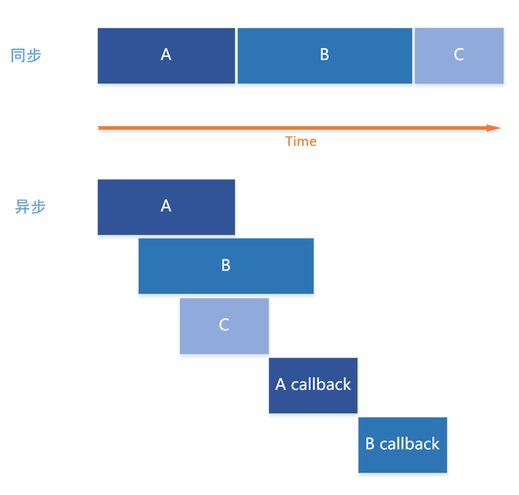
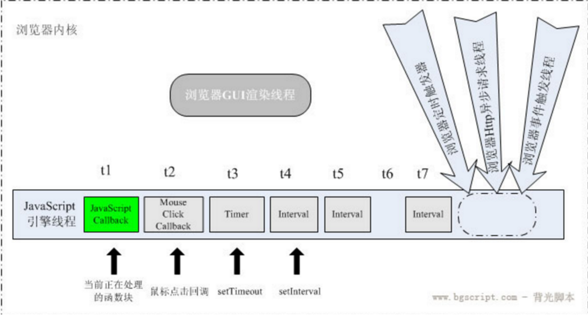

# 深度理解JS异步

tags: JavaScript, Event Loop, Asynchronous

> 当人们谈及JavaScript时，总能提起它的事件循环（Event Loop），非阻塞（Non-blocking），回调（Callback），异步（Asynchronous），单线程（Single-threaded）和并发（Concurrency）等标签，这些标签到底是什么意思呢？

## 基本概念

### 线程（Thread）

  官方解释：CPU的基本调度单位。意味着可以被分配到不同的CPU上执行。
  
  多线程目的：
    - 功能模块划分，各司其职（GUI）
    - 提高运行效率（多核并行执行，或者单核里，某个线程I/O时，另一个线程继续执行）

  多线程：
    - 多线程在同一个进程里，共享内存和其他资源；
    - 多个线程可以同时写入由进程打开的同一个文件；

### 进程（Progress）

  官方解释：计算机中正在运行的程序**实体**。
  早期面向进程设计的OS中，进程是基本执行实体；现代面向线程设计的OS中，进程不是基本运行单位，而是线程的容器。
  一个程序可以有多个进程，一个进程可以拥有多个线程。
  
  多进程：
    - 通常指的是OS下运行多个进程，即多个应用同时运行；
    - 多进程程序，如Chrome，每个页面/插件/拓展都是一个单独的进程，相互隔离；
    - OS不允许多个进程同时写入同一个文件；

  > OS区别： 
  > 1. Window创建进程时间开销很大，Linux创建进程时间开销小； 
  > 2. Window多线程学习重点是资源争抢和同步，Linux学习重点是进程建通讯；
  > 2. 多核心CPU中的核心切换开销：由于进程的资源独立，所以进程在CPU核心之间切换开销小；由于每个线程共享资源，核心切换会导致资源的跨核心复制，所以线程的核心切换开销大；

### 串行（Sequential） VS 并行（Parallelism）VS 并发（Concurrency）

  假设由2个任务A, B。
  串行：逐个处理任务；（A->B）
  并行：同时处理多个任务；(A/B)
  并发：交替处理多个任务；(A1->B1->A2->A3-B2)

### 同步（Synchronous） VS 异步（Asynchronous）

  同步：串行执行任务，逐个完成任务。
  异步：每个任务都有回调，上一个任务还没执行完就可以开始执行下一个任务。

  

## 真正的耗时操作

  在计算机系统中，CPU的运行速度是很快的，真正系统拉低速度往往是对I/O设备的访问。常见的I/O操作包含存储器读取和网络通信。

  具体到JS中，I/O操作包含文件读取，XHR请求等。

## 浏览器内核（WebCore）

  

  浏览器内核实现多个线程异步执行。至少有三个常驻线程： JS Engine，界面渲染线程，浏览器事件触发线程。除此以外还有一些执行完就终止的线程，如HTTP请求线程。
  这些异步线程都会产生不同的异步事件。

  JS引擎是基于事件驱动（Event Loop）的

  
  **渲染线程与JS线程是互斥的**

## Node.js

  Node.js的单线程Event Loop

  

## 实践

  setTimeout/setInterval/setImmediate/Promise/nextTick

## Reference

- [知乎：多线程有什么用](https://www.zhihu.com/question/19901763/answer/13299543)
- [JavaScript的单线程和异步](https://zhuanlan.zhihu.com/p/23659122)
- [JavaScript的线程问题](http://blog.csdn.net/kfanning/article/details/5768776)
- [Promise的队列和setTimeout的队列有何关联](https://www.zhihu.com/question/36972010)
- [Event loop](http://www.ruanyifeng.com/blog/2014/10/event-loop.html)
- [JavaScript单线程](http://greengerong.com/blog/2015/10/27/javascript-single-thread-and-browser-event-loop/)
- [图片：Node.js系统框图](https://twitter.com/wprl/status/496643917559758848)